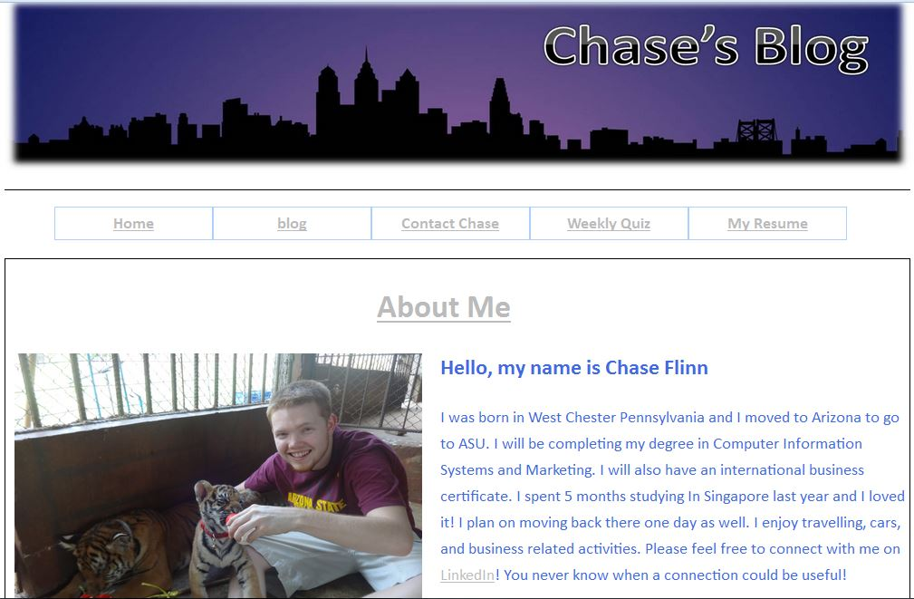
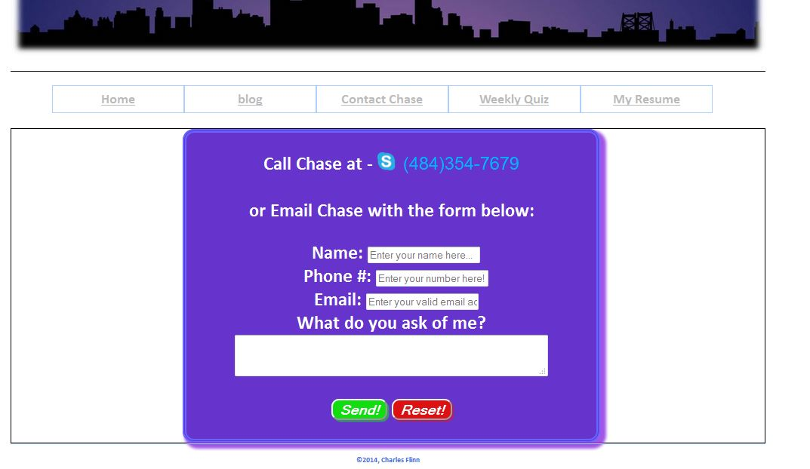
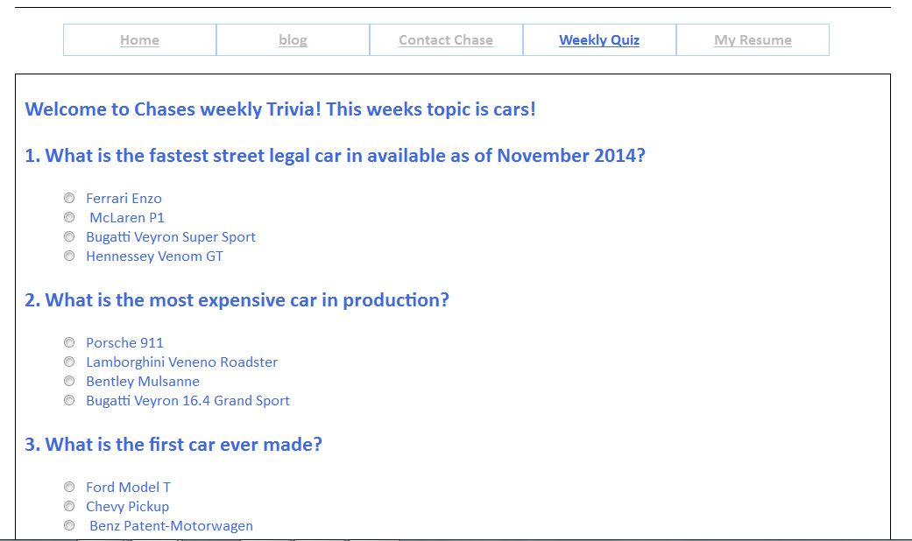
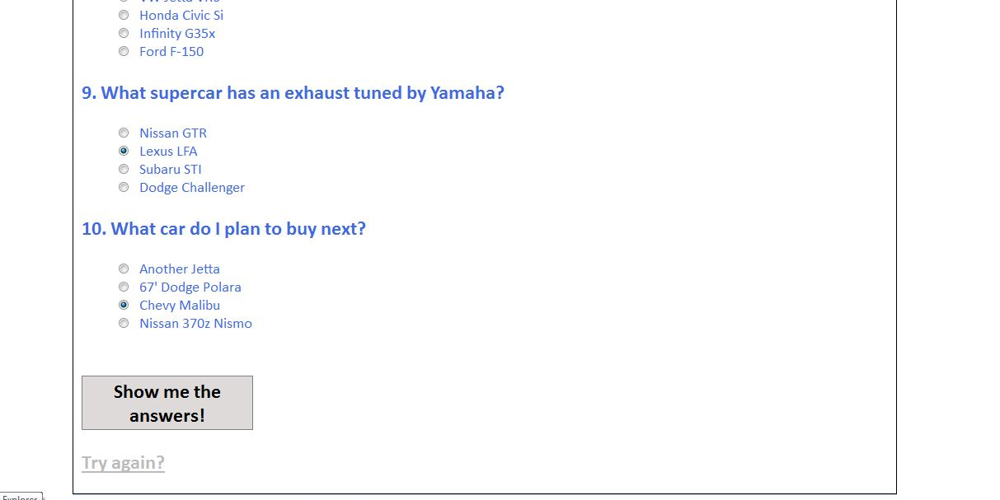
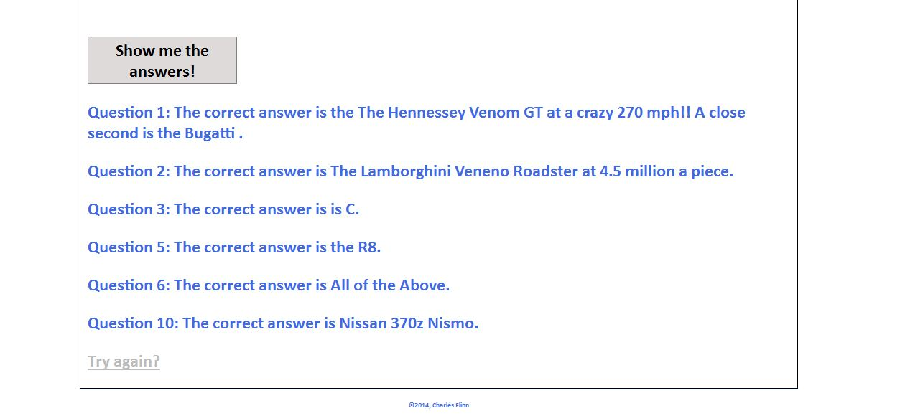

CharlesFlinnIndividualProject
=============================

Chase's Blog

For my project, due to time restrictions I decided to start creating a blog for myself.  
Within this blog I created a simple home page which contains my first post that is about myself. 
In this post I created a LinkedIn that links directly to my page to encourage connections. I will also at some point include a way for 
people to comment on my post as well. The navigation bar possesses links to a copy of my resume,
as well as an email form, a weekly quiz, and a link to all of the blog post.

<b>Below is an image of my homepage:</b>

Just a basic layout was used and I created the banner using powerpoint.

The email form is also quite simple and is styled to match the color theme

<b>Below are a few screenshots for the HTML and Java script weekly quiz I created</b>

I found an example of this quiz format online at <a href="http://www.hungrypiranha.org/make-a-website/html-quiz" target="_blank">this website</a> and it provided most of the Javascript for me 
as seen in the code files provided.  All I needed to do was adjust the JS, HTML, and CSS to fit what I wanted to do.

<b>Below is a screen shot of what occurs when one answers a question wrong</b>

<b>Finally below is a screen shot my Resume that gets displayed as a PDF when one clicks the link in the navigation bar</b>

